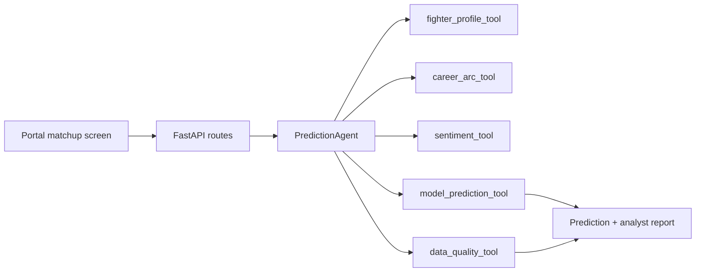

# Prediction Agent Architecture

The app now routes roster-based matchup analysis through a structured prediction agent.
The first implementation is deterministic and does not require an LLM key. It is designed so an
OpenAI Agents SDK runner can later replace or augment the orchestration without changing the API
contract.

## Current Flow



## Public Contract

`POST /api/v1/agents/predict`

```json
{
  "fighter_a_id": 1,
  "fighter_b_id": 2,
  "include_sentiment": true
}
```

The response includes:

- `prediction`: winner, probabilities, confidence, profile comparison, and matchup factors.
- `agent.tool_runs`: each analysis check that ran and its status.
- `agent.data_quality`: source counts and missing-context warnings.
- `agent.model_read`: top factors and final read.
- `agent.wager_readiness`: current odds context and required controls before any future wager flow.

## Wagering Boundary

The current agent is research-only. Automated wagering should only be added behind:

- approved sportsbook API or partner integration;
- explicit user account authorization;
- user confirmation for each wager;
- identity, age, location, and jurisdiction checks;
- responsible gaming limits and audit logs.

The agent report intentionally keeps `wager_readiness` separate from `prediction` so future bet-slip
or execution work can be controlled independently from model inference.
