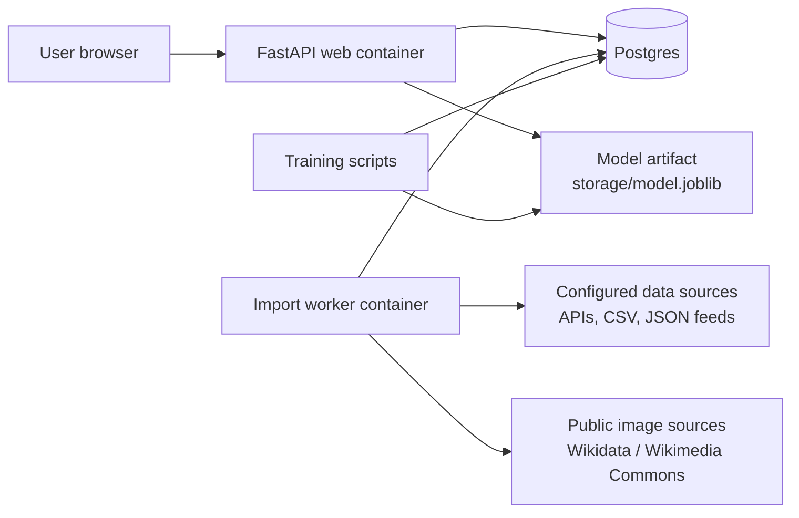
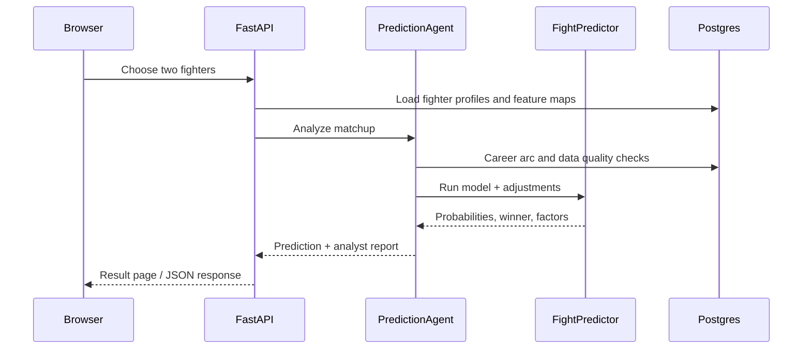
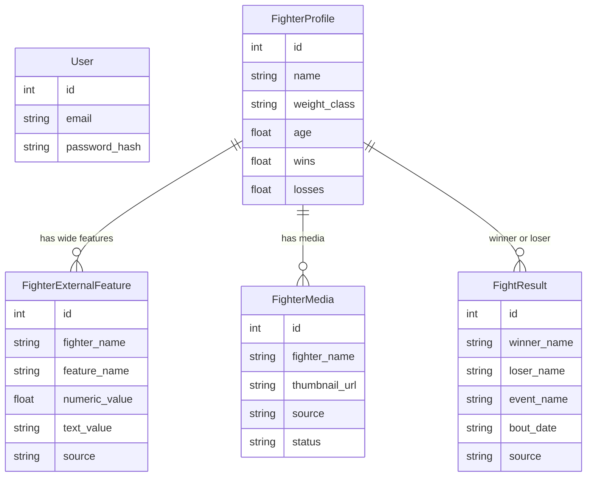
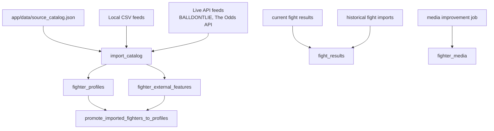
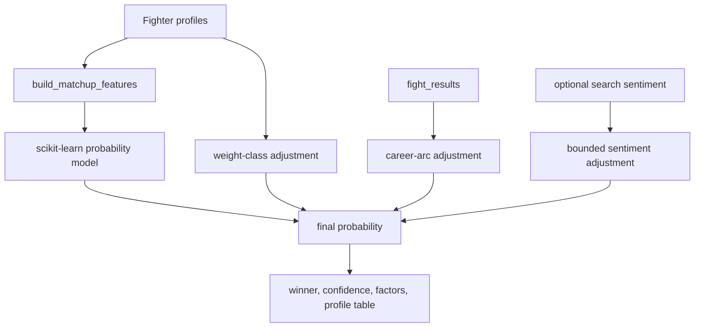
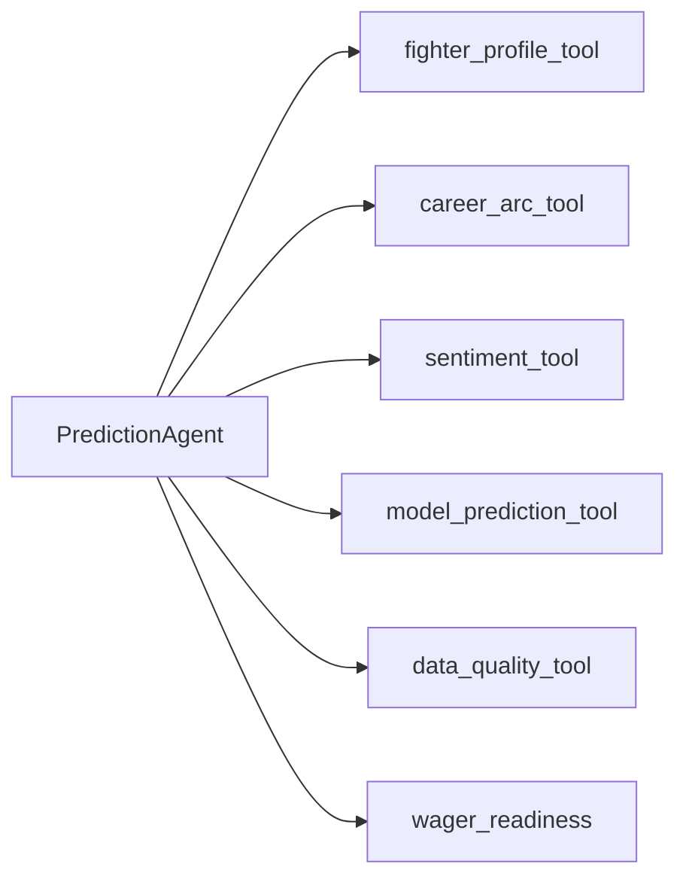

# Project Architecture

MMA Fight Predictor is a FastAPI portal for fighter lookup, matchup prediction, data ingestion,
career-history analysis, and structured prediction-agent reports. The app is designed to run locally
with Docker Compose and to deploy as separate web, worker, and Postgres services.

## System Topology

### Containers

| Service | Purpose |
| --- | --- |
| `db` | Local Postgres database for users, fighters, external features, media, and fight results. |
| `web` | FastAPI/Jinja portal, public JSON API, prediction endpoint, and agent endpoint. |
| `worker` | Scheduled import cycle for source catalog records, live fights, historical fight results, and media improvement. |

## Request Flow

## Data Model

## Ingestion Flow

The source catalog supports local paths, URLs, JSON record paths, CSV files, cursor pagination,
environment-variable placeholders, field mappings, and wide external-feature capture.

## Prediction Flow

The current model is trained with scikit-learn candidates and stores the selected artifact at
`storage/model.joblib`. The predictor applies bounded adjustments for weight mismatch, career arc,
and optional search sentiment.

## Prediction Agent

`PredictionAgent` is deterministic today and returns a stable JSON contract:

- `prediction`: winner, probabilities, confidence, matchup factors, and profile comparison.
- `agent.tool_runs`: which analysis checks ran and their status.
- `agent.data_quality`: source coverage and missing-context warnings.
- `agent.model_read`: concise explanation of the model read.
- `agent.wager_readiness`: research-only readiness checks for any future betting workflow.

This shape is intended to support a later OpenAI Agents SDK runner without changing clients that
already call `POST /api/v1/agents/predict`.

## Future Wagering Boundary

Automated betting is not implemented. Any future wager-assistant workflow should be separate from
prediction inference and require:

- approved sportsbook API or partner integration;
- explicit user account authorization;
- human confirmation for every wager;
- identity, age, location, and jurisdiction checks;
- responsible gaming limits;
- audit logs and user-visible history.

The app currently exposes `wager_readiness` as a research and compliance planning object only.
